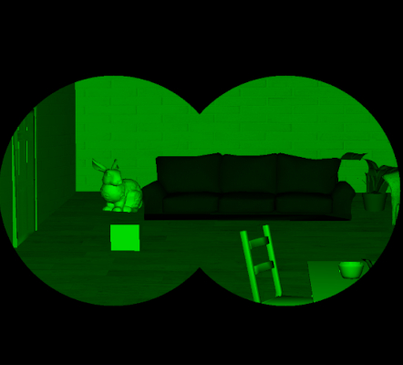
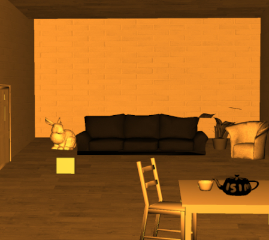

# pogl_project
Collection of shaders by Sophie STARCK and Ngoc Phuong Anh DUONG.\
The project is heavily based on [POGL course and TPs](http://jo.fabrizio.free.fr/teaching/synt/index.php) at EPITA.

### Usage:
To build the project:
```
mkdir build
cd build
cmake .. && make 
```
Usage:
```
./pogl <shader>
shaders:
 - simple
 - sepia
 - night_vision
 - glitch
 - depth_map
 - anaglyph
 - depth_of_field
 - stroboscope
 - glitter
 - swirl
 - fish_eye
```
Examples:
```
./pogl night_vision
```


```
./pogl sepia
```


```
./pogl glitch
```


### Used libraries / dependencies
stb image loading [here](https://github.com/nothings/stb)

### References
 * Matrices - projection, view, model: [TPs](http://jo.fabrizio.free.fr/teaching/synt/index.php) + [here](https://solarianprogrammer.com/2013/05/22/opengl-101-matrices-projection-view-model/)
 * Glitch effect (only ideas): [here](https://codemyui.com/image-glitch-effect-using-opengl-shading-language/)
   (We were trying to simulate this effect in our own way, without referencing their codes ) 
 * Anaglyph shader formula is based on: [here](http://paulbourke.net/stereographics/anaglyph/)
 * Framebuffer with rendering a scene to a texture: [here](https://learnopengl.com/Advanced-OpenGL/Framebuffers)
 * Swirl algorithm: [here](http://supercomputingblog.com/openmp/image-twist-and-swirl-algorithm/)
 * 2D Rotation (UV rotation): [here](https://matthew-brett.github.io/teaching/rotation_2d.html)
 * The fish eye shader formulas are based on: [this website](http://paulbourke.net/dome/fisheye/)
 
#### .Obj data sources:
(before being triangulated by using Blender):
 * table: [here](https://free3d.com/3d-model/straight-leg-coffee-tablepine-v1--697100.html)
 * chair: [here](https://free3d.com/3d-model/chair-255345.html)
 * teacup: [here](https://free3d.com/3d-model/cup-933734.html)
 * plant: [here](https://free3d.com/3d-model/house-plant-01-60848.html)
 * door: [here](https://free3d.com/3d-model/-wooden-door-v3--266879.html)
 * sofa: [here](https://free3d.com/3d-model/casual-sofa-denim-v1--415793.html)
 * armchair: [here](https://free3d.com/3d-model/chair---artichoke-580579.html)
 * paper airplane: [here](https://free3d.com/3d-model/paper-airplane-58536.html)